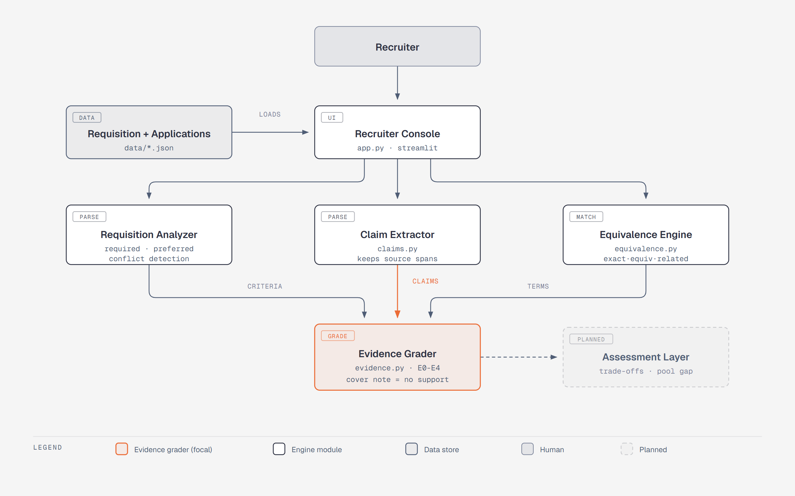
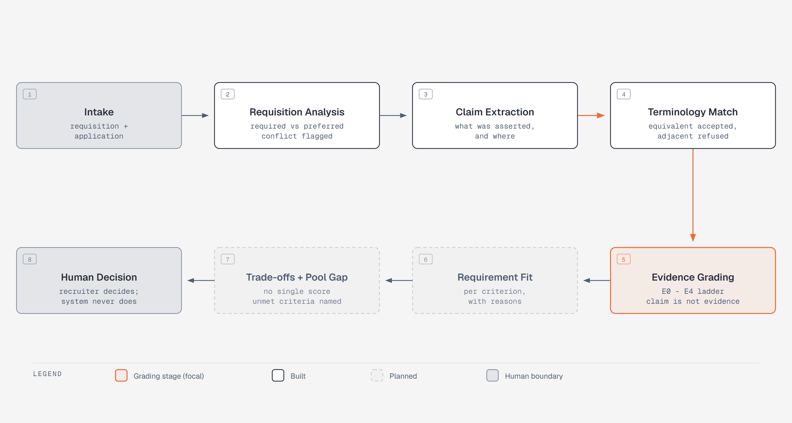

# EvidenceHire

**Don't just read what candidates claim. Verify what the evidence supports.**

An evidence-first talent-acquisition screening agent built for **X'O Code 2026 —
PS02: Autonomous Talent-Acquisition Screening Agent**.

---

## The Problem

Recruiting teams screen large volumes of applications against a job requisition.
Conventional screening matches keywords — if the résumé says "Python" and the
requisition says "Python," it counts as a hit.

That approach fails in three specific ways:

1. **It rewards résumé padding.** A bare claim of *"Expert in distributed
   systems"* scores identically to a candidate who actually shipped one.
2. **It punishes honest phrasing.** Someone who writes *"built and maintained
   ROS 2 navigation packages"* may never use the exact requisition keyword, and
   gets filtered out despite being qualified.
3. **It hides bad requisitions.** When a requirement asks for *5+ years of
   professional experience* on a role advertised as *junior*, keyword matching
   silently produces a weak candidate pool instead of flagging the conflict.

## The Core Idea

The question this system asks is not:

> *Does the résumé contain the required keyword?*

It is:

> **How well-supported is this claim, before we trust it?**

Every skill claim is separated from the **evidence that backs it inside the same
application**, graded on an evidence ladder, and reported with the reasoning
attached. A claim and its evidence are never conflated.

---

## What It Does

### 1. Evidence-graded claim assessment

Each claim a candidate makes is located, then matched against supporting
evidence found in their own application, and placed on a five-level ladder:

| Level | Meaning | Typical evidence |
|---|---|---|
| **E0** | No evidence | Claim appears with nothing behind it |
| **E1** | Weak | Skill listed only, a course, a generic mention |
| **E2** | Moderate | Academic or personal project with real description |
| **E3** | Strong | Work/internship project, technical implementation detail |
| **E4** | Very strong | Multiple independent supporting signals, consistent timeline |

> **Claim strength is not evidence strength.** A candidate may claim *"Expert"*
> while the supporting evidence sits at E0. The system reports both, separately.

### 2. Terminology equivalence — without false matches

Equivalent skills described in different words are recognized, and merely
*adjacent* technologies are not silently accepted:

```
ROS 2  <->  Robot Operating System 2  <->  ROS2 Humble   -> equivalent
Computer Vision  <->  OpenCV / image processing          -> equivalent
Version Control  <->  Git                                -> equivalent
Arduino  ->  ROS 2                                       -> NOT equivalent
```

Each match is classified as *exact*, *equivalent terminology*, *related
technology*, or *insufficient evidence* — never a blind string match.

### 3. Trade-offs instead of one opaque score

Candidates are not collapsed into a single number. Fit is reported per
requirement, with an explicit trade-off statement:

```
A-07   Best fit: core robotics development
       Strong:  ROS 2, Python, autonomous navigation
       Gap:     cloud deployment (no supporting evidence)
       Risk:    "Expert in AWS" claim is unsupported

A-09   Best fit: cloud + perception work
       Strong:  cloud deployment, computer vision
       Gap:     weaker ROS 2 depth
```

Two candidates can both be right answers for different versions of the role.
The system surfaces that rather than manufacturing a winner.

### 4. Talent-pool gap detection

When *no candidate* satisfies a requirement, that is a fact about the
requisition and the market — not a candidate failing:

```
POOL GAP DETECTED
Requirement:  production cloud/Kubernetes deployment
Fully satisfying:  0 / 12
Closest evidence:  A-04 (coursework), A-08 (academic project), A-11 (Docker)
```

### 5. Requisition conflict detection

The requisition itself is analysed for internally inconsistent requirements:

```
Requirement:  5+ years professional ROS 2 experience
Role level:   Junior Engineer
Flag:         Potential requirement conflict — recruiter review required
```

Conflicts are surfaced, never silently resolved.

### 6. Within-document consistency checks

Discrepancies detectable from the application alone are flagged for human
review — for example, a stated *"3 years of professional experience"* against
listed roles that total roughly 18 months.

These are reported as **discrepancies requiring verification**, never as
accusations.

---

## Explainability

Every assessment carries its provenance. No conclusion is shown without the
source text that produced it:

```
ROS 2 — Evidence: E4 — Confidence: High

Why:
  - Internship project with implementation detail
  - Named navigation stack work
  - Consistent project timeline
  - Reinforced in cover note
```

The chain is always visible and always in this order:

**claim -> evidence -> assessment -> confidence**

---

## Architecture



The console loads the requisition and the applications. Three parsers read
them — requisition analysis, claim extraction, terminology matching — and all
three deliver into the evidence grader, which decides how well-supported each
claim is before anything downstream is allowed to trust it.

### Screening workflow



Eight stages from raw application to human decision. Grading is the pivot:
nothing after it treats a claim as proven until the evidence behind that claim
has been placed on the ladder. The final stage is a person — the system
produces an auditable assessment, never a hiring decision.

### Project structure

```
evidencehire/
├── app.py                 # Streamlit entry — recruiter console
├── pages/                 # candidate detail, comparison, pool gaps, pipeline
├── engine/
│   ├── models.py          # typed domain models
│   ├── requisition.py     # required/preferred split + conflict detection
│   ├── claims.py          # claim extraction
│   ├── equivalence.py     # terminology equivalence engine
│   ├── evidence.py        # evidence discovery + E0-E4 grading
│   ├── assessment.py      # per-requirement fit + confidence reasoning
│   ├── discrepancy.py     # within-document consistency checks
│   ├── tradeoffs.py       # multi-dimensional comparison + shortlist
│   ├── poolgap.py         # pool-level gap detection
│   └── llm.py             # optional LLM adapter (cached)
├── data/
│   ├── requisition.json
│   └── applications/      # demo application set
└── tests/
```

## Tech Stack

| Layer | Choice | Rationale |
|---|---|---|
| Language | Python 3.11 | Strongest text-processing ecosystem for this problem |
| UI | Streamlit | Working recruiter console with no build step or JS toolchain |
| Models | Pydantic | Typed, self-documenting domain objects |
| Engine | Deterministic, rules-first | Runs fully offline — the demo never depends on network or API quota |
| LLM | Optional, disk-cached adapter | Assists the hardest judgment calls; cached so runs are reproducible |
| Storage | JSON | Human-inspectable; a reviewer can read the data directly |

The engine is deliberately **rules-first with optional LLM assistance**, not
LLM-only. Every grade the system assigns can be traced to a rule and a source
span, which is what makes the output auditable rather than a black box.

---

## Getting Started

```bash
git clone <repository-url>
cd evidencehire

python -m venv .venv
.venv\Scripts\activate         # macOS/Linux: source .venv/bin/activate

pip install -r requirements.txt
streamlit run app.py
```

Optional — enable LLM-assisted assessment:

```bash
cp .env.example .env           # then add your API key to .env
```

`.env` is git-ignored. No credentials are committed to this repository.

---

## Demo Dataset

The evaluation set is one job requisition (*Junior Robotics Software Engineer*)
and twelve applications, authored to exercise the hard cases:

- a strong, well-evidenced candidate
- a keyword-heavy candidate whose claims are unsupported
- candidates describing equivalent skills in different terminology
- a strong candidate missing one required area entirely
- a career-switcher with transferable but differently-worded evidence
- a coursework-heavy candidate with no applied evidence
- **one requirement that no candidate in the pool fully satisfies**

All demo data is synthetic and clearly labelled as such.

---

## What This System Deliberately Does Not Do

These are design decisions, not missing features:

- **It does not accuse.** Inconsistencies are reported as *discrepancy*,
  *unverified*, or *requires review* — never as dishonesty.
- **It does not claim certainty it cannot support.** Evidence that was not
  retrieved is never described as if it were.
- **It does not infer protected or personal characteristics** — no personality,
  health, beliefs, family situation, or lifestyle inference, and no use of
  unrelated social-media behaviour in a hiring decision.
- **It does not judge whether code was AI-generated.** That cannot be
  determined reliably from heuristics, so the system does not pretend to.
- **It does not make the hiring decision.** It produces an auditable assessment;
  a human decides.

---

## Roadmap

Beyond the hackathon scope:

- External evidence verification from candidate-provided public repositories
- Cross-source consistency graph across multiple independent evidence sources
- Configurable evidence weighting per organisation
- Recruiter feedback loop to tune equivalence mappings

---

## Team

**Team BOT BABY** — Team ID XO01
Manakula Vinayagar Institute of Technology

| Member | Register No. | Role |
|---|---|---|
| Madanraj M | 23TRL004 | Team Lead — coordination, integration, submission |
| Ganisetti Veera Venkata Satyanarayana | 23TRL001 | Screening engine — claims, evidence, assessment |
| Santhosh N | 24TR0028 | Recruiter console UI, demo scenario |

---

## Build Status

Actively developed during the X'O Code 2026 24-hour hackathon (9–10 September
2026). Commit history reflects genuine development progress across the
scheduled checkpoints.

---

**Problem Statement:** PS02 — Autonomous Talent-Acquisition Screening Agent
**Event:** X'O Code 2026, Manakula Vinayagar Institute of Technology
